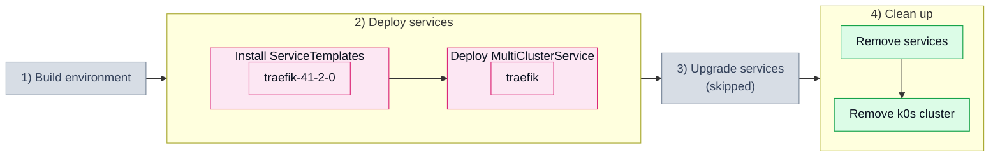

# 1.1. Basic service (101_basic)

## Tested steps

1. Install the ServiceTemplate for `traefik` and wait for it to report `valid`.
2. Deploy one MultiClusterService carrying that single service.
3. `traefik` — deployed helm release in the child cluster, pods ready. The release,
   not the namespace: namespaces linger after earlier scenarios.
4. The MCS reports `ClusterInReadyState`.
5. Remove the services: MCS, ServiceSet, helm release and workloads all gone.

## Scenario schema

Defined in [`101_basic.yaml`](101_basic.yaml).
