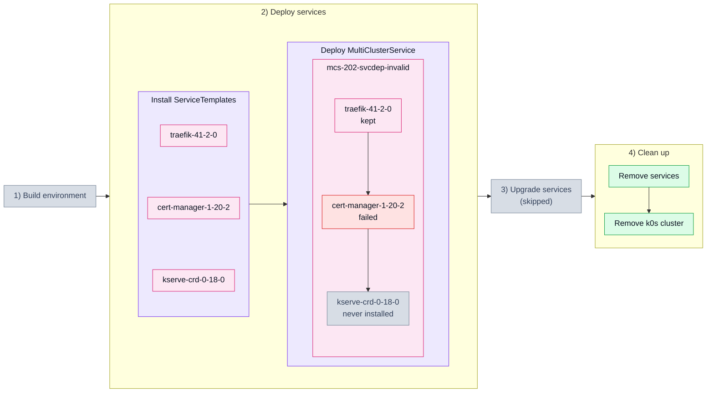

# 2.2. Invalid service in a dependency chain (202_svcdep_invalid)

## Tested steps

1. Install the ServiceTemplates and wait for each to report `valid`.
2. Deploy one MultiClusterService carrying `traefik → cert-manager → kserve-crd`.
   `cert-manager` asks for `replicaCount: -1`, which helm refuses — invalid values
   rather than a missing image, because a bad image still yields a successful release
   and the chain would simply carry on.
3. `cert-manager` is stamped `Failed` in the ServiceSet, and the ServiceSet itself must
   not report `deployed` while one of its services is failed.
4. For 120s `kserve-crd` stays uninstalled: never `Deployed`, and no workloads left in
   its namespace. Long enough to tell blocked from merely slow. KCM reports a blocked
   service by leaving it out of the status, not by listing it as pending.
5. `traefik` was deployed before the failure and has to survive it — `Deployed`, with
   its workloads still there. A moment of `Provisioning` is a re-reconcile and is
   tolerated; `Failed` is a rollback and is not.
6. Remove the services: MCS, ServiceSet, helm releases and workloads all gone.

## Scenario schema

Defined in [`202_svcdep_invalid.yaml`](202_svcdep_invalid.yaml).
