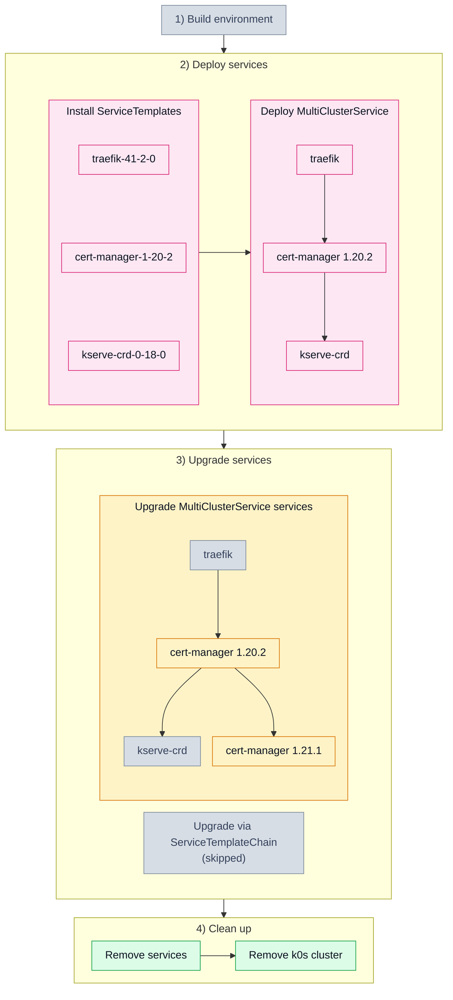

# 3.1. Upgrade one service of a chain (301_upgrade)

## Tested steps

1. Install the ServiceTemplates and wait for each to report `valid`.
2. Deploy one MultiClusterService carrying `traefik → cert-manager → kserve-crd`, pods
   ready where declared.
3. Record the state everything later is judged against: helm revision, chart version
   and pod UIDs per service.
4. Install the ServiceTemplate for `cert-manager` 1.21.1 and patch the MCS to it.
   `cert-manager` sits in the middle, so both directions are checked at once.
5. `cert-manager` — the ServiceSet says `Deployed` and the helm release is on chart
   `1.21.1`, `deployed`. The status matters as much as the version: helm stamps the new
   revision as soon as the upgrade starts.
6. `traefik` and `kserve-crd` — same chart version and the very same pod UIDs. A moved
   helm revision with unchanged pods is only warned about, replaced pods are a failure.
7. Remove the services: MCS, ServiceSet, helm releases and workloads all gone.

## Scenario schema

Defined in [`301_upgrade.yaml`](301_upgrade.yaml).
