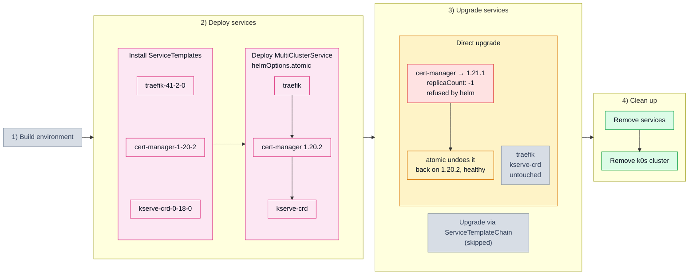

# 3.2. Failed atomic upgrade (302_upgrade_invalid_atomic)

## Tested steps

1. Install the ServiceTemplates and wait for each to report `valid`.
2. Deploy one MultiClusterService carrying `traefik → cert-manager → kserve-crd` with
   `helmOptions.atomic` set from the first deploy — adding it at upgrade time makes
   sveltos reinstall rather than upgrade.
3. Record the state everything later is judged against: helm revision, chart version
   and pod UIDs per service.
4. Upgrade `cert-manager` to 1.21.1 with `replicaCount: -1` on top, so it is the
   upgrade that fails. Unlike [`202_svcdep_invalid`](202_svcdep_invalid.md) there is a
   previous healthy state to return to.
5. Wait for the release to settle back on chart `1.20.2`, `deployed`, at a higher
   revision than before. Helm reports `failed` briefly on the way, so only a sustained
   reading decides: 90s on a failed release, or 90s with no release at all, and the
   scenario fails — removed instead of rolled back is its own verdict.
6. `cert-manager` pods ready again: a rollback that leaves nothing running is not one.
7. `traefik` and `kserve-crd` — same chart version, same pod UIDs.
8. Remove the services: MCS, ServiceSet, helm releases and workloads all gone.

## Scenario schema

Defined in [`302_upgrade_invalid_atomic.yaml`](302_upgrade_invalid_atomic.yaml).
