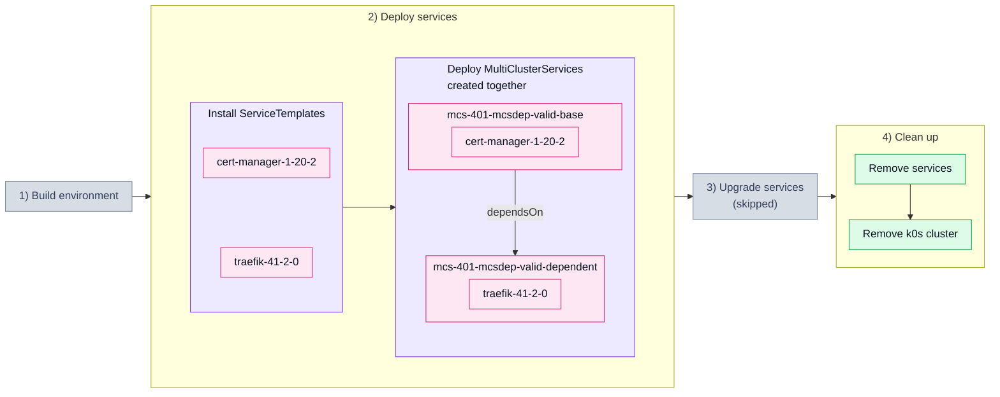

# 4.1. Dependent MultiClusterService (401_mcsdep_valid)

## Tested steps

1. Install the ServiceTemplates and wait for each to report `valid`.
2. Create both MultiClusterServices in a single apply — `base` with `cert-manager`,
   `dependent` with `traefik` and `dependsOn: base`. One apply on purpose: creation
   order must not be what sequences them, only `spec.dependsOn`.
3. Record when each MCS first gets a ServiceSet and when it first reports every service
   deployed.
4. `dependent` must not get its ServiceSet before `base` reported deployed — moment
   compared against moment, so a fast `base` cannot make this pass by accident.
5. Both end up deployed: helm releases `deployed` in the child cluster, pods ready.
6. Remove the services: MCSs, ServiceSets, helm releases and workloads all gone.

## Scenario schema

Defined in [`401_mcsdep_valid.yaml`](401_mcsdep_valid.yaml).
