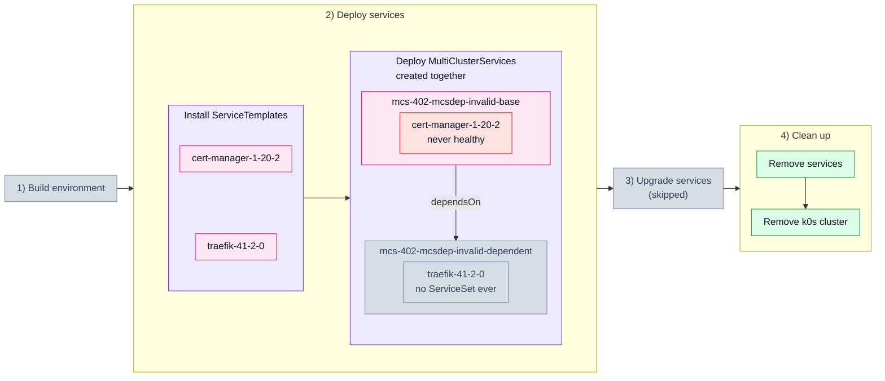

# 4.2. Broken MultiClusterService dependency (402_mcsdep_invalid)

## Tested steps

1. Install the ServiceTemplates and wait for each to report `valid`.
2. Create both MultiClusterServices in a single apply. `base` carries `cert-manager`
   with `replicaCount: -1`, which helm refuses, so it never becomes healthy;
   `dependent` carries `traefik` and `dependsOn: base`.
3. For 180s `dependent` must get no ServiceSet at all — not a late rollout, none. The
   whole window is sat out whatever happens, so a slow start cannot pass for a refusal.
4. Report the conditions `dependent` is left with.
5. Remove the services: MCSs, ServiceSets, helm releases and workloads all gone.

## Scenario schema

Defined in [`402_mcsdep_invalid.yaml`](402_mcsdep_invalid.yaml).
