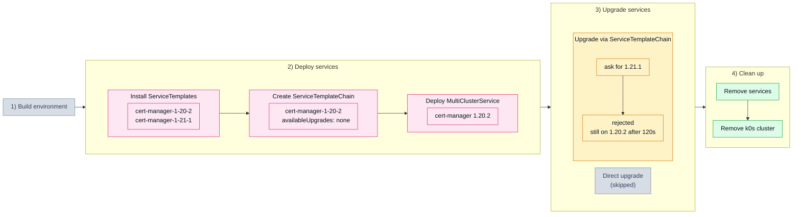

# 5.2. Chain offering no upgrades (502_chain_boundary)

## Tested steps

1. Install the ServiceTemplates for `1.20.2` and `1.21.1` and wait for each to report
   `valid` — the target exists as a template, only the chain refuses it.
2. Create the ServiceTemplateChain listing `1.20.2` alone, deliberately with no
   `availableUpgrades`.
3. Deploy one MultiClusterService with `cert-manager` on `1.20.2`, pods ready.
4. Ask for `1.21.1` and watch for 120s: the release must stay on `1.20.2`. A refusal is
   the absence of a change, so it needs the whole window; any move is an immediate
   failure. KCM keeps the stored version rather than erroring, so nothing-changed is
   the only observable.
5. Remove the services: MCS, ServiceSet, helm release and workloads all gone.

## Scenario schema

Defined in [`502_chain_boundary.yaml`](502_chain_boundary.yaml).
